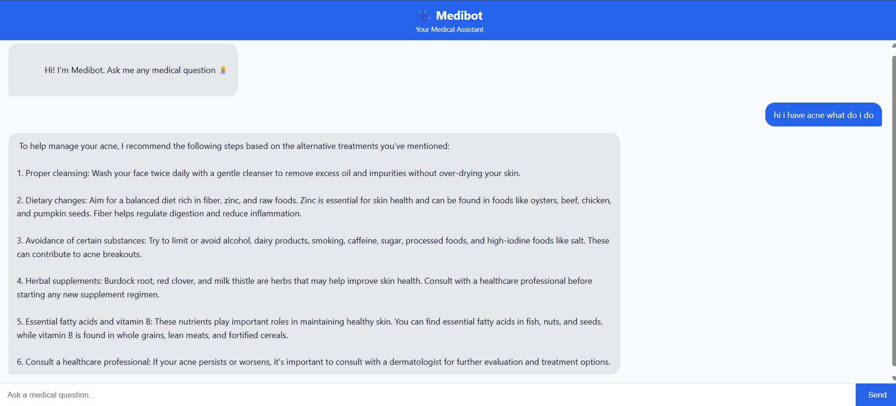

# A Medical-Chatbot
=======
# 🩺 Medibot – A Medical Chatbot

Medibot is an **end-to-end medical question-answering chatbot** built using **Retrieval-Augmented Generation (RAG)**.  
It allows users to ask medical questions and receive accurate, context-aware responses based on medical documents.

The system uses **Pinecone** for vector storage, **HuggingFace embeddings** for semantic search and **Ollama (Mistral)** as the local LLM for answer generation.

# STEP2)Install requirements
'''bash
pip install -r requirements.txt
''' 
=======
---

## 🚀 Features

- 📄 Load and process medical PDF documents
- ✂️ Split documents into semantic chunks
- 🧠 Generate embeddings using HuggingFace
- 🗂️ Store and retrieve vectors using Pinecone
- 🤖 Generate answers using a local LLM (Ollama – Mistral)
- 🌐 Web-based chat interface using Flask
- ⚡ Context-aware responses using RAG architecture

---

## 🛠️ Tech Stack

- **Python 3.10+**
- **Flask**
- **LangChain**
- **Pinecone**
- **HuggingFace Embeddings**
- **Ollama (Mistral model)**
- **HTML + CSS + JavaScript**

---

## 🖥️ Frontend Preview

